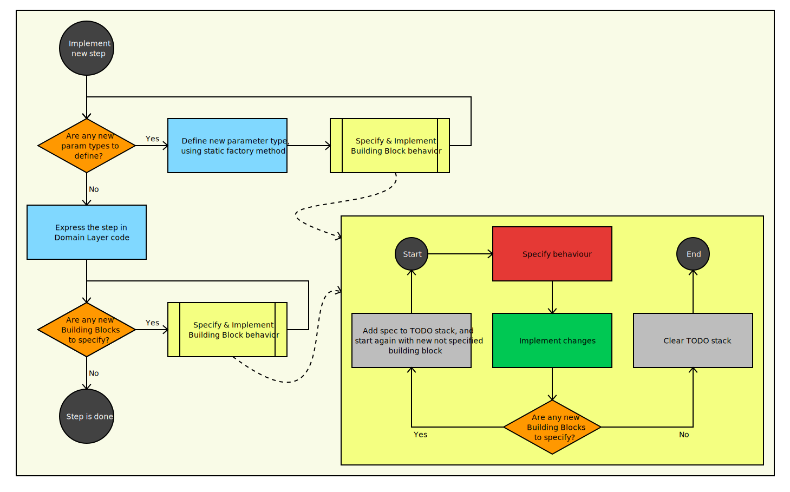

# BDD Kata in TypeScript

Design your *Domain Layer* by example, using BDD.
Use Gherkin as a *Common Language*,
to write *User Stories* and *Example Scenarios*.
Follow the Design/Specify/Implement pattern,
 to drive your process:

1. **📝 Design** your *Domain Layer* by translating the *Common Language* of into code. Use [DDD building blocks][ddd-building-blocks] to express your *Domain Layer*.
2. **💬 Specify** the behaviors of the Building Blocks using Jest.
3. **✅ Implement** the Building Blocks using the specifications.

## Guided Kata

This repository contains code written while exercising
BDD Kata.
It comes with basic project setup, and tool configuration out-of-box.
To start working with the code you need to run `npm install` to fetch the dependencies.

#### Preparation

To practice this Kata, please remove the existing code of the solution.
For that you need to delete all the files in [src/][src/],
and now we are ready to start doing this Kata (again)!

Use cucumber to run Gherkin scenarios:

    npm run cucumber

When you run in it for the first time
it will generate missing step definitions.
Save the orange text from the output into [src/cucumber/domain.ts](src/cucumber/domain.ts).

Remove lines like these:

    ? Given a flight "XX4029" flies from the "LHR" to "MAN" route
    Undefined. Implement with the following snippet:

Then add missing imports:

    import { Given, When, Then } from '@cucumber/cucumber';

---

### 1. There is a flight...

    Given a flight "XX4029" flies from the "LHR" to "JFK" route`

In this part you will learn:
- How to use `defineParameterType` to bind primitive values from the *Example*
as [Domain Layer][domain.ts] types in *Executable Specification*.
- How to introduce a Flight object that can be shared across different *Steps*.

#### 1.1. Define FlightNumber as a Parameter Type

`FlightNumber` must be used in the signature of *Step Definition* in the *Executable Specification*.

🐣 Create new class in [src/domain/FlightNumber.ts][FlightNumber.ts] with content like this:

    export class FlightNumber {}

🏷️ In the [Executable Specification][domain.ts] define parameter type `FlightNumber`,
*transformer* should call `FlightNumber.fromCode` to instantiate a new `FlightNumber`.
Add a placeholder implementation with a quick-fix "Declare static method fromCode".

💬 Specify that [FlightNumber > can be created from code as a string][FlightNumber.spec.ts].
Make sure it is working with "XX4030", "XX3".

✅ Make it pass by calling `new FlightNumber` from [`FlightNumber.fromCode`][FlightNumber.ts].
Make the constructor private!

💬 [FlightNumber > cannot be created with invalid code][FlightNumber.spec.ts].
Should throw error with "", "1000XX", "XX".

✅ Check if it matches regex `/^[A-Z]{2}\d{1,4}$/`.

#### 1.2. Define Airport as a Parameter Type

`Airport` must be used in the signature of *Step Definition* in the *Executable Specification*.

🐣 Create new class in [src/domain/Airport.ts][Airport.ts] with content like this:

    export class Airport {}

Make sure it is imported in the [Executable Specification][domain.ts]

🏷️ Define parameter type `Airport`, *transformer* should call `Airport.fromCode` to instantiate a new `Airport`.
Add a placeholder implementation with a quick-fix "Declare static method fromCode".

💬 Specify that [Airport > can be created from code as a string][Airport.spec.ts].
Make sure it is working with "JFK".

✅ Make it pass by calling `new Airport` from [`Airport.fromCode`][Airport.ts].
Make the constructor private!

💬 [FlightNumber > cannot be created with invalid code][Airport.spec.ts].
Should throw error with "", "123", "BABY".

✅ Check if it matches regex `/^[A-Z]{3}$/`.

#### 1.3 Turn example into code

📝 Extract `flight` variable so that it can be used in other steps of the *Executable Specification*.

- Combine the two airports from the parameters into a route.
- Combine the flight number from the parameters and the route into the flight.
- Let `flight` variable be available in all the step definitions

🐣 create a new class `Flight` in [src/domain/Flight.ts][Flight.ts]

    export class Flight {}

Flight is described by flight number and a route. We have `FlightNumber` type already.

🐣 create a new class `Route` in [src/domain/Route.ts][Route.ts]

Use static method `Route.fromTo` to instantiate `Route`, declare it with quick-fix.

Use `Flight.withFlightNumberAndRoute` to instantiate `Flight`, declare it with quick-fix.

Notice, we don't use calls to constructor, but static factory methods instead.

#### 1.4. Create Route & Flight

💬 Specify [Route > can be created from departure and destination][Route.spec.ts]

✅ Trivial implementation, but don't forget to define the constructor as private.

💬 Specify [Flight > can be build with a flight number and a route][Flight.spec.ts]

✅ Also trivial implementation, but don't forget to define the constructor as private.

---

### 2. There is a list of fares...

    And the current listed fare for the "LHR" to "JFK" is $50.00

How to use *Fake Implementations* for adapters which are outside of the *Domain Layer*.

#### 2.1. Define Fare as a Parameter Type

`Fare` must be used in the signature of *Step Definition* in the *Executable Specification*.

🐣 Create new class in [src/domain/Fare.ts][Fare.ts] with content like this:

    export class Fare {}

Make sure it is imported in the [Executable Specification][domain.ts]

🏷️ Define parameter type `Fare`, *transformer* should call `Fare.fromString` to instantiate a new `Fare`.
Add a placeholder implementation with a quick-fix "Declare static method fromCode".

💬 Specify that [Fare > can be created from a string][Fare.spec.ts].
Make sure it is working with "100.00".

✅ Make it pass by calling `new Fare` from [`Fare.fromString`][Fare.ts].
Use `bigint` to store minor units for the amount of money.

Make the constructor private!

💬 [Fare > cannot be created from wrong format][Airport.spec.ts].
Should throw error with "", "100.000", "100.00.00".

✅ Check if it matches regex `/^[\d]*\.\d\d$/`.
(Unlike previously, this check will be done in the static factory method itself, rather than constructor)

##### 2.2. Use FareList to list fares

📝 This step is instructing a Fare, to be listed, in some sort of repository.
In this repository, fares can be listed and retrieved by route.

- Route is defined by departure and destination from the parameters.
- Fare comes from parameters too.
- Fare is listed using `FareList.listFare`.
- Let `fareList` be of type `FareList`, with fake implementation coming from `MemoryFareList`.
- Extract `fareList` variable, so it can later be used in other *Execute Specification Steps*

#### 2.3. Use fake implementation for FareList adapter

🐣 Create `FareList` interface in [src/domain/FareList.ts][Farelist.ts]:

    export interface FareList {
      findFareFor(route: Route): Fare;
      listFare(route: Route, fare: Fare): void;
    }

Although this interface is a part of Ticket domain,
it's implementations are not.
For this *Executable Specification* we will use in-memory implementation of `FareList`.

🐣 It will be declared in [src/domain/MemoryFareList.ts][MemoryFarelist.ts]

    export class MemoryFareList implements FareList {
      private fares: { [id: string]: Fare } = {};

      listFare(route: Route, fare: Fare): void {
        this.fares[route.asString()] = fare;
      }
  
      findFareFor(route: Route): Fare {
        const fare: Fare = this.fares[route.asString()];
        if (!fare) {
          throw new Error(`Cannot find fare: ${route.asString()}`);
        }
        return fare;
      }
    }

Use quick-fix to declare method `toString` in `Route`. 

#### 2.4. Missing methods used in the Fake implementation

💬 [Route > can be represented as string][Route.spec.ts].
So route object could be serialized into a string like "LHR-JFK".

✅ [Route.toString][Route.ts] will use `Airport.asCode`,
which can be declared as a quick-fix.

<!-- ⛔ [Route > can be represented as string][Route.spec.ts]
will be skipped until `Airport.asCode` is done. -->

💬 [Airport > can be represented as code string][Airport.spec.ts]

✅ [Airport.toCode][Airport.ts] obvious implementation.

<!-- ⬆️ Un-skip [Route > can be represented as string][Route.spec.ts] -->

### 3. The ticket is issued...

    When I am issued a ticket on a flight XX4030

Specifying behavior in this step.
However, there is no way to tell the *Behavior* is correct
before we got into the *Expectations* part.

Do not assume anything! Just let this step pass...

#### 3.1. Define the step

📝 This step will extract `ticket` variable,
so it can later be used in the *Executable Specification*.

- a `Ticket` type variable will be extracted
- It will use `TicketIssuer.issueOn` method to create a ticket.
- `TicketIssuer` is not constructed with `FareList` for now.

🏷️ FlightNumber is mapped from *Example*, but it is not used here in this step.

#### 3.2. Introducing Ticket

`Ticket` is used in the *Executable Specification*.

🐣 Create new class in [src/domain/Ticket.ts][Ticket.ts] with content like this:

    export class Ticket {}

💬 Specify that [Ticket > can be created by cost][Ticket.spec.ts].
Make sure it can be created with a $100 fare.

✅ Make it pass by calling `new Ticket` from [`Ticket.costing`][Ticket.ts].
Make the constructor private!

#### 3.3. Introducing TicketIssuer

🐣 Create new class in [src/domain/TicketIssuer.ts][TicketIssuer.ts] with content like this:

    export class TicketIssuer {}

💬 Specify that [TicketIssuer > issues ticket for a flight][TicketIssuer.spec.ts].
Just make sure it does not throw any error in the process.
inside the `describe` block it has `const ticketIssuer = new TicketIssuer();`

Extract flight, so that this spec turns into

Add another define to turn this spec into
[TicketIssuer > with flight XX4 from JFK to LHR > issues ticket for a flight][TicketIssuer.spec.ts]

✅ Make it compiles using a quick fix to add static method `Ticket.costing`,

Don't worry about the fare, just pass $123, to construct the ticket.
The goal here is to make TicketIssuer work. 

### 4. Ticket is paid...

    And I pay $250.00 cash for the ticket

🏷️ Ensure that the fare is correctly mapped from the *Example*.

📝 Design for this step by simply calling `ticket.pay(fare)`;
Again, we oly care about design, and the behavior is to be defined later...

💬 Specify [Ticket > costing $100 > can be paid][Ticket.spec.ts], just check that paying does not throw any error.

✅ Implement `Ticket.pay` in [Ticket.ts][Ticket.ts] with smallest possible code,
like we were doing TDD (just `return;` for now )

### 5. Add some logic into Domain Layer

    Then the ticket should be completely paid

Now more logic to *Domain Layer* is to be added...

#### 5.1. Add an expectation to the Executable Specification 

📝 Design this step:

    expect(ticket.isCompletelyPaid()).toBeTruthy();

Don't forget to add:

    import expect from 'expect';

Now that we reached "Then",
we need to make sure our methods are implemented correctly.

#### 5.2. Making sure the ticket is paid correctly

The `ticket.isCompletelyPaid` can be created by a quick fix.

💬 Specify [Ticket > costing $100 > is not completely paid initially][Ticket.spec.ts],
so that a new ticket costing $100 is not completely paid.

✅ Make it pass with `return false` from [Ticket.isCompletelyPaid][Ticket.ts]

💬 Specify [Ticket > costing $100 > can be paid completely][Ticket.spec.ts]
This will call `Ticket.pay`

✅ use not-yet-implemented `Fare.deduct` in [Ticket.pay][Ticket.ts],
so this spec cannot be satisfied for now. Now rename property `fare` to `outstandingFare`.

> 💬 Specify [Fare > can deduct an amount][src/domain/Fare.spec.ts]
> 
> ✅ Implement [Fare.deduct][src/domain/Fare.ts].

✅ Implement [ticket.isCompletelyPaid][Ticket.ts]:
- introduce/rename an `outstandingFare`;
- `Ticket.isCompletelyPaid` should check `Fare.isZero`;

> 💬 Specify [Fare > knows when it is zero][Fare.spec.ts]
> 
> ✅ Pass it with `return true` from [Fare.isZero][Fare.ts]
> 
> 💬 Specify [Fare > is not zero when it has value][Fare.spec.ts]
> 
> ✅ A proper implementation will check the minorUnits

#### 5.3. Making sure the ticket is issued correctly

If we run cucumber now, it should fail because it does not match the expectation.
Now that we have defined what the expectation is,
can come back to the *Domain Layer* to make it behave correctly.

💬 [TicketIssuer > with flight XX4 from JFK to LHR > issues a ticket with listed fare`][TicketIssuer.spec.ts],
so it is not just issuing any ticket like before,
but the ticket returned by FareList

First ensure stub library is imported:

    import { stubInterface } from 'ts-sinon';

Add to the top of `TicketIssuer` description.

    const fareList = stubInterface<FareList>();
    fareList.findFareFor
      .withArgs(Route.fromTo(Airport.fromCode('JFK'), Airport.fromCode('LHR')))
      .returns(Fare.fromString('300.00'));

And call constructor with `new TicketIssuer(fareList)`

The specification will be like following:

    const ticket = ticketIssuer.issueOn(flight);
    expect(ticket).toEqual(Ticket.costing(Fare.fromString('300.00')));

✅ Implement [Ticket.issueOn][TicketIssuer.ts] making sure it:
- Constructor accepts FareList as an argument,
- Uses fare from the `FareList.findFareFor`,
- with a route got from `Flight.getRoute` method (which is not-yet-defined);

<!-- Skip [TicketIssuer: issues a ticket with listed fare][TicketIssuer.spec.ts] until `Flight.getRoute` is unimplemented. -->

<!-- maybe Flight.getRoute is implemented if we did that thing in 3.2 -->

💬 Specify [Flight > can get route](src/domain/Flight.spec.ts).

✅ Implement [`Flight.getRoute`](src/domain/Flight.ts)
<!-- Un-skip [TicketIssuer: issues a ticket with listed fare](src/domain/TicketIssuer.spec.ts)  -->

📝 Make sure you fareList is passed to TicketIssuer constructor in *Executable Specification*

✅ Go back to `TicketIssuer.issueOn` and ensure takes fare from fareList.

## 6. Introduce points functionality:

    And the ticket should be worth 250 loyalty points

🏷️ It needs [Points](src/cucumber/domain.ts) parameter type to be defined.
The parameter type definition uses `Points.fromString` static factory,
use quick fix to add a placeholder implementation:

🐣 Create new class in [src/domain/Points.ts][Points.ts] with content like this:

    export class Points {}

💬 [Points > can be created from string][Points.spec.ts], for example "100";

✅ Just call private constructor

💬 [Points > cannot be created from wrong format][Points.spec.ts]
like "010", "100.00", "1A".

✅ Throw errors if it is not an integer

📝 Step definition for be like:

    expect(ticket.getPoints()).toEqual(points);

💬 [Ticket > costing $100 > gets points from original fare][Ticket.spec.ts]:

✅ In [Ticket.getPoints](src/domain/Ticket.ts) use `revenueFare` for points calculation
(and the `outstandingFare` to track if the ticket is paid or not)

💬 [Fare > calculates points][Fare.spec.ts]
for example $100.00 fare, gives 100 points.

✅ Implement [Fare.getPoints](src/domain/Fare.ts);

## Design/Specify/Implement workflow

Goal of this Kata is to learn the workflow of
Design by example and coding it.
The workflow is displayed in the picture bellow:

In the beginning of this Kata, we intentionally did not exactly follow the diagram, to make it easier to learn simple concepts first.

[src/]: ../ticket-service/src/
[domain.ts]: ../ticket-service/src/cucumber/domain.ts
[FlightNumber.ts]: ../ticket-service/src/domain/FlightNumber.ts
[FlightNumber.spec.ts]: ../ticket-service/src/domain/FlightNumber.spec.ts
[Airport.ts]: ../ticket-service/src/domain/Airport.ts
[Airport.spec.ts]: ../ticket-service/src/domain/Airport.spec.ts
[Flight.ts]: ../ticket-service/src/domain/Flight.ts
[Flight.spec.ts]: ../ticket-service/src/domain/Flight.spec.ts
[Route.ts]: ../ticket-service/src/domain/Route.ts
[Route.spec.ts]: ../ticket-service/src/domain/Route.spec.ts
[Fare.ts]: ../ticket-service/src/domain/Fare.ts
[Fare.spec.ts]: ../ticket-service/src/domain/Fare.spec.ts
[FareList.ts]: ../ticket-service/src/domain/FareList.ts
[FareList.spec.ts]: ../ticket-service/src/domain/FareList.spec.ts
[MemoryFareList.ts]: ../ticket-service/src/adapter/MemoryFareList.ts
[MemoryList.spec.ts]: ../ticket-service/src/adapter/MemoryFareList.spec.ts
[Ticket.ts]: ../ticket-service/src/domain/Ticket.ts
[Ticket.spec.ts]: ../ticket-service/src/domain/Ticket.spec.ts
[TicketIssuer.ts]: ../ticket-service/src/domain/TicketIssuer.ts
[TicketIssuer.spec.ts]: ../ticket-service/src/domain/TicketIssuer.spec.ts
[Points.ts]: ../ticket-service/src/domain/Points.ts
[Points.spec.ts]: ../ticket-service/src/domain/Points.spec.ts

[ddd-building-blocks]: https://en.wikipedia.org/wiki/Domain-driven_design#Building_blocks